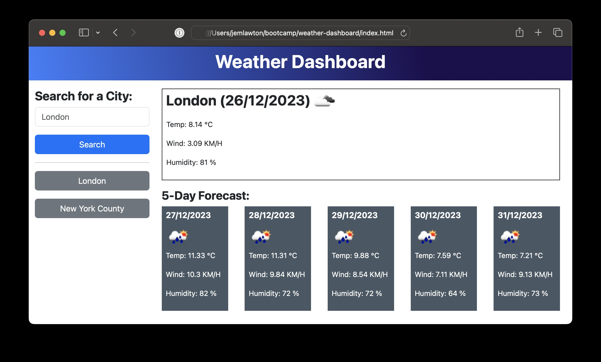

# Front End Bootcamp - Weather Dashboard

## Description

The purpose of this project was to build a weather dashboard to run in the browser and feature dynamically updated HTML and CSS and use `localStorage` to store the search history.

Multipe API's were used to achieve this, such as multiple OpenWeather API endpoints to get both the current weather and forecast, and Day.js in order to display and format the date.

Buttons were dynamically generated on each search and each city stored to `localStorage`.

I spent some time organising the code once finished to ensure its readability, trying to group related objects together with clear comments.

## Deployed Application

* [Weather Dashboard on GitHub Pages](https://partialarts.github.io/weather-dashboard/)

## Usage

To use this web page, open index.html inside a browser.

Input a city name into the search field and click `Search`. The weather for that location will be displayed as well as a 5-day forecast. The city searched will be stored and a button generated for this.

## Screenshot

### External Tutorials and Resources

* [OpenWeather API](https://openweathermap.org/api)
* [Day.js](https://day.js.org/)
* [CSS Gradient Generator](https://cssgradient.io/)
* [localStorage in JavaScript: A complete guide](https://blog.logrocket.com/localstorage-javascript-complete-guide/)

## License

MIT - [See LICENSE file in repo](https://github.com/partialarts/weather-dashboard/blob/main/LICENSE)